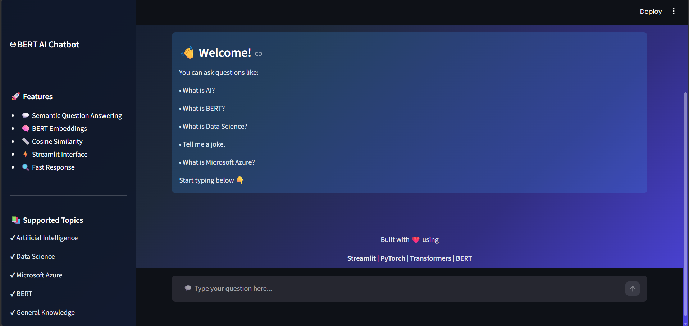
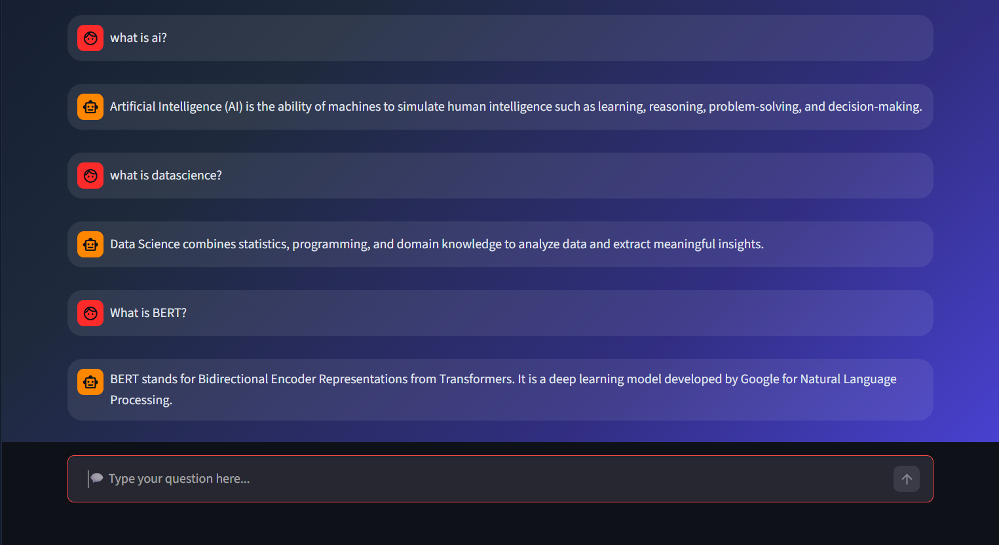

# 🤖 BERT AI Chatbot

A modern AI chatbot built using **BERT (Bidirectional Encoder Representations from Transformers)** and **Streamlit**. The chatbot understands user queries using semantic similarity and provides intelligent responses based on predefined knowledge.

The application features a modern ChatGPT-inspired interface with a beautiful gradient background, chat history, and an intuitive user experience.

---

## 📸 Project Preview


```
project/
│
├── screenshots/
│   ├── home.png
│   └── chat.png
```

---

## ✨ Features

- 🤖 BERT-powered semantic chatbot
- 💬 ChatGPT-style user interface
- 🧠 Semantic search using cosine similarity
- 🎨 Modern gradient UI
- 📜 Chat history using Streamlit Session State
- ⚡ Fast response generation
- 📱 Responsive layout
- 🔍 Intelligent question matching
- 🧹 Clear Chat functionality
- 🌙 Professional dark theme

---

## 🛠 Tech Stack

- Python
- Streamlit
- Hugging Face Transformers
- PyTorch
- Scikit-Learn
- BERT Base Uncased

---

## 📂 Project Structure

```text
BERT-AI-Chatbot/
│
├── screenshots/
│   ├── chat.png
│   └── home.png    
│
├── bert_chatbot.py
├── requirements.txt
└── README.md
```

---

## ⚙️ Installation

### 1 Clone Repository

```bash
git clone https://github.com/manasranjanmeher99/BERT-AI-Chatbot.git
```

### 2 Go to Project Folder

```bash
cd BERT-AI-Chatbot
```

### 3 Create Virtual Environment

Windows

```bash
python -m venv .venv
```

Activate

```bash
.venv\Scripts\activate
```

Linux / Mac

```bash
source .venv/bin/activate
```

---

## 📦 Install Dependencies

```bash
pip install -r requirements.txt
```

or

```bash
pip install streamlit torch transformers scikit-learn
```

---

## ▶️ Run the Application

```bash
streamlit run bert_chatbot.py
```

The application will automatically open in your browser.

---

## 🧠 How It Works

### Step 1

The user enters a question.

↓

### Step 2

The BERT tokenizer converts the sentence into tokens.

↓

### Step 3

The BERT model generates contextual embeddings.

↓

### Step 4

Cosine similarity compares the user's embedding with predefined question embeddings.

↓

### Step 5

The chatbot returns the most relevant answer.

---

## 💡 Supported Questions

Examples:

- What is AI?
- What is BERT?
- What is Data Science?
- What is Microsoft Azure?
- Tell me a joke.
- How are you?
- What is your name?

---

## 📊 Architecture

```text
User Input
      │
      ▼
Tokenizer
      │
      ▼
BERT Model
      │
      ▼
Sentence Embedding
      │
      ▼
Cosine Similarity
      │
      ▼
Best Matching Question
      │
      ▼
Response
```

---

## 📸 UI Features

- Gradient Background
- Modern Chat Interface
- Chat History
- Sidebar
- Responsive Design
- Dark Theme
- Professional Layout

---

## 📚 Libraries Used

```python
streamlit
transformers
torch
scikit-learn
base64
```

---

## 🚀 Future Improvements

- Voice Input
- Voice Output
- OpenAI Integration
- Gemini Integration
- Claude Integration
- Chat Memory
- Database Support
- User Authentication
- PDF Question Answering
- Multi-language Support
- Dark / Light Theme Switch
- Deployment on Streamlit Cloud

---

## 📈 Learning Outcomes

This project demonstrates knowledge of:

- Natural Language Processing (NLP)
- BERT Architecture
- Transformer Models
- Semantic Search
- Cosine Similarity
- Streamlit Development
- Python Programming
- Machine Learning Concepts

---

## 📸 Screenshots

### Home Page



---

### Chat Interface



---


## 📌 Requirements

- Python 3.10+
- Streamlit
- PyTorch
- Transformers
- Scikit-Learn

---

## 👨‍💻 Author

**Manas Ranjan Meher**


GitHub:
https://github.com/manasranjanmeher99

LinkedIn:
https://www.linkedin.com/in/manas-ranjan-meher-606181280/

---

## ⭐ If you like this project

Give it a ⭐ on GitHub and share your feedback!

---
